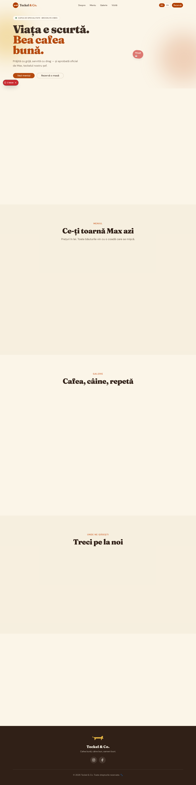

# Teckel Coffee & Cocktails

Website pentru cafeneaua fictivă **Teckel Coffee & Cocktails**, condusă (în mare parte) de Zucchini — teckelul arlechin șef.

Site single-page cu secțiuni: Hero, About, Meniu, Galerie, Vizită și Contact/Rezervări. Suportă două limbi (RO / EN) cu toggle în navbar.



## Stack

- [Next.js 16](https://nextjs.org/) — App Router
- [React 19](https://react.dev/)
- [TypeScript](https://www.typescriptlang.org/)
- [Tailwind CSS v4](https://tailwindcss.com/)
- [shadcn/ui](https://ui.shadcn.com/) — componente UI
- [Motion](https://motion.dev/) — animații
- [Vercel Analytics](https://vercel.com/analytics) — activ doar în producție

## Cerințe

- **Node.js** ≥ 18
- **pnpm** ≥ 8 (proiectul folosește `pnpm-lock.yaml`)

```bash
# Instalează pnpm dacă nu îl ai
npm install -g pnpm
```

## Pornire locală

```bash
# 1. Clonează repo-ul (sau dezarhivează folderul)
cd coffee-shop-website

# 2. Instalează dependențele
pnpm install

# 3. Pornește serverul de dezvoltare
pnpm dev
```

Deschide [http://localhost:3000](http://localhost:3000) în browser.

## Comenzi disponibile

| Comandă | Descriere |
|---|---|
| `pnpm dev` | Server de dezvoltare cu hot-reload |
| `pnpm build` | Build de producție |
| `pnpm start` | Pornește build-ul de producție local |
| `pnpm lint` | Rulează ESLint |

## Structura proiectului

```
coffee-shop-website/
├── app/
│   ├── layout.tsx       # Root layout, fonturi Google, metadata
│   ├── page.tsx         # Pagina principală — compune toate secțiunile
│   └── globals.css      # Variabile CSS, teme, stiluri globale
├── components/
│   ├── navbar.tsx       # Navigație + toggle limbă RO/EN
│   ├── hero.tsx         # Secțiunea hero cu animație
│   ├── about.tsx        # Povestea cafenelei
│   ├── menu.tsx         # Meniu cu băuturi și prețuri
│   ├── gallery.tsx      # Galerie foto
│   ├── visit.tsx        # Program și adresă
│   ├── contact.tsx      # Formular rezervări
│   ├── footer.tsx
│   └── ui/              # Componente shadcn (Button, Input etc.)
├── lib/
│   ├── i18n.tsx         # Context + dicționar traduceri RO/EN
│   └── utils.ts         # Helper cn()
└── public/
    └── images/          # Imagini site (logo, hero, galerie)
```

## Internaționalizare

Traducerile sunt gestionate client-side prin `lib/i18n.tsx`. Limba implicită este **română**; se schimbă prin butonul din navbar. Nu există rute separate per limbă — tot conținutul este pe `/`.

## Deploy

Proiectul este gata pentru deploy pe **Vercel** (zero config). `@vercel/analytics` se activează automat în producție.

```bash
# Build de producție local (verificare înainte de deploy)
pnpm build && pnpm start
```